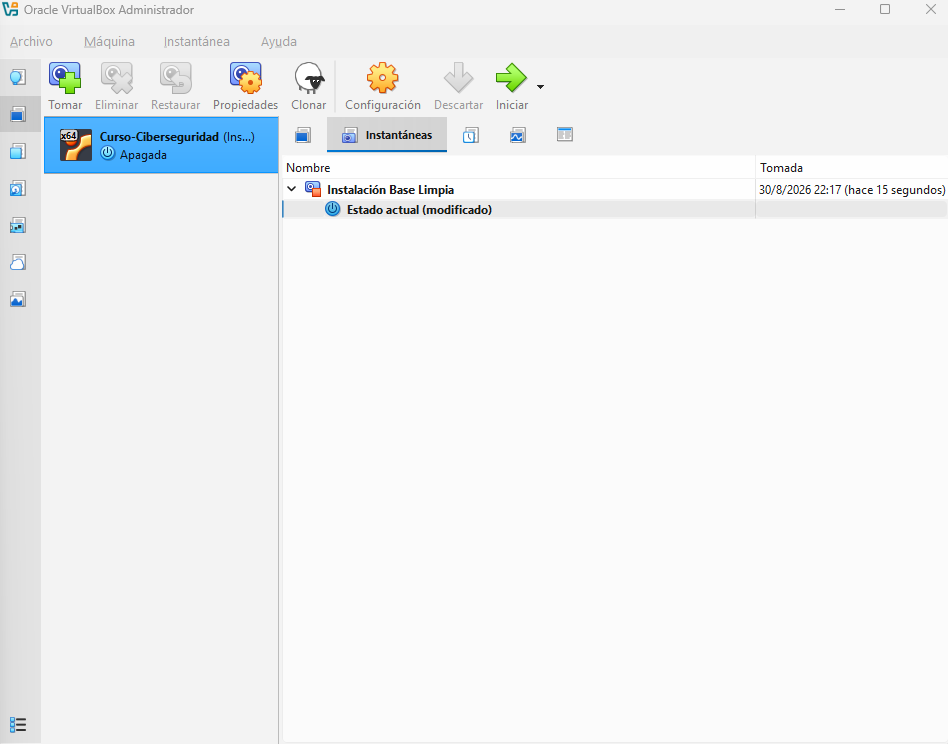
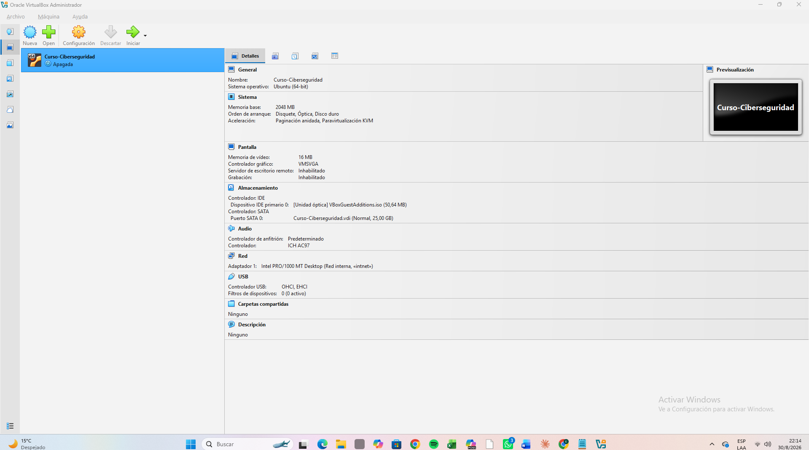

# Laboratorio de Ciberseguridad - Entorno de Pruebas Virtualizado

Entorno de pruebas controlado y aislado, construido con VirtualBox, para el curso de Ciberseguridad. La máquina virtual utiliza **Kali Linux** como sistema invitado.

## 1. Configuración de red

Captura de la sección Red de VirtualBox mostrando el modo elegido:

## 2. Justificación técnica

Para este laboratorio se eligió el modo **Red Interna (Internal Network)** en lugar de "Puente (Bridged)" o "NAT". La Red Interna crea una red virtual completamente aislada que solo es visible para las máquinas virtuales configuradas explícitamente dentro de ella: ni el sistema anfitrión (host) ni el resto de la red doméstica pueden verla o acceder a ella, y tampoco tiene salida a internet. Este aislamiento es fundamental en un entorno de pruebas de ciberseguridad, ya que evita que herramientas de escaneo, explotación o tráfico malicioso generado dentro de la VM lleguen accidentalmente a dispositivos reales de la red (routers, otras computadoras, IoT, etc.), y sienta las bases para armar más adelante escenarios con múltiples VMs (por ejemplo atacante/víctima) que se comuniquen únicamente entre sí. Se descartó el modo **Puente (Bridged)** porque este conecta la VM directamente a la red física del host, asignándole una IP visible y accesible desde cualquier otro dispositivo de esa red; esto expondría el laboratorio (con herramientas y configuraciones potencialmente vulnerables) a la red doméstica real, rompiendo el principio de aislamiento que es la base de cualquier entorno de pruebas seguro.

## 3. Snapshot del estado inicial

Captura del Administrador de Instantáneas mostrando el snapshot "Instalación Base Limpia":

## Detalles del entorno

- **Hipervisor:** VirtualBox + Extension Pack
- **Sistema invitado:** Kali Linux (amd64)
- **Recursos asignados:** 2 GB RAM, 2 núcleos de CPU, disco de 20-25 GB
- **Modo de red:** Red Interna (Internal Network)
- **Guest Additions:** instaladas
