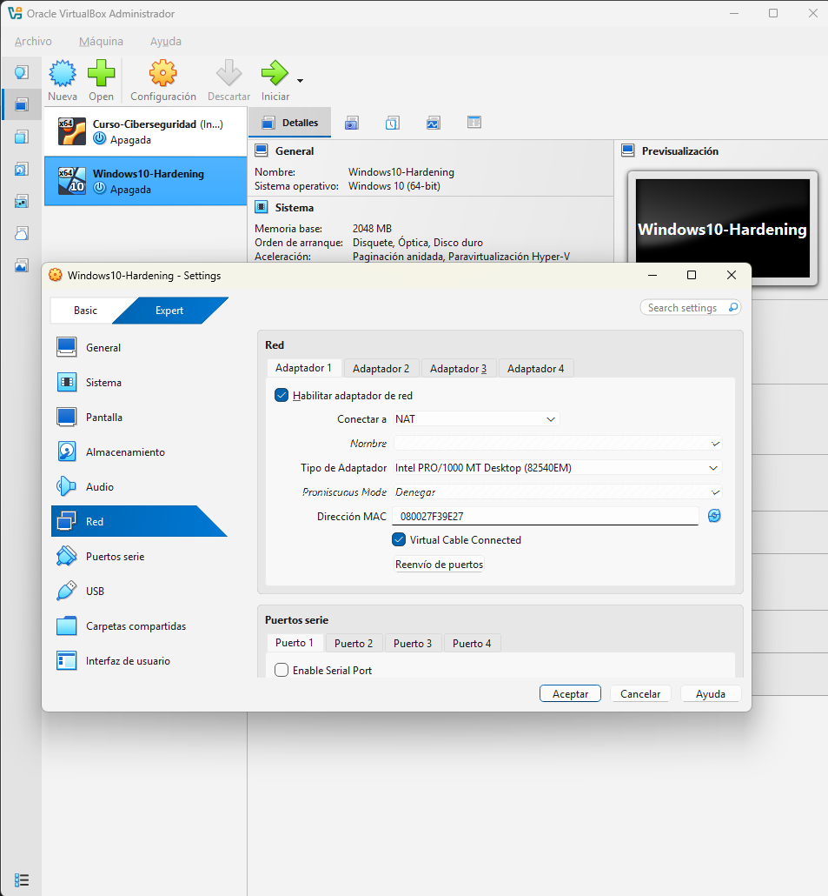
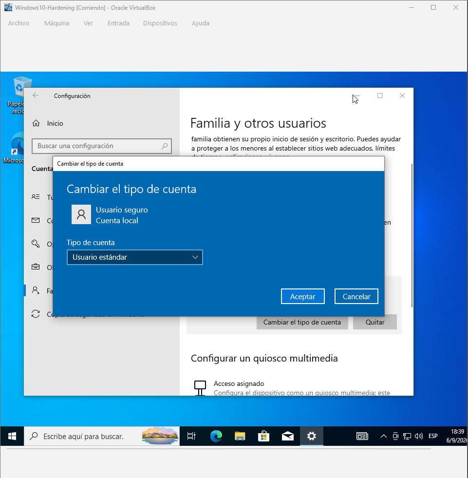
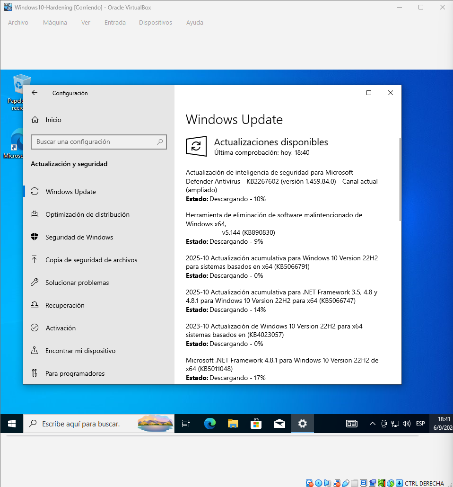
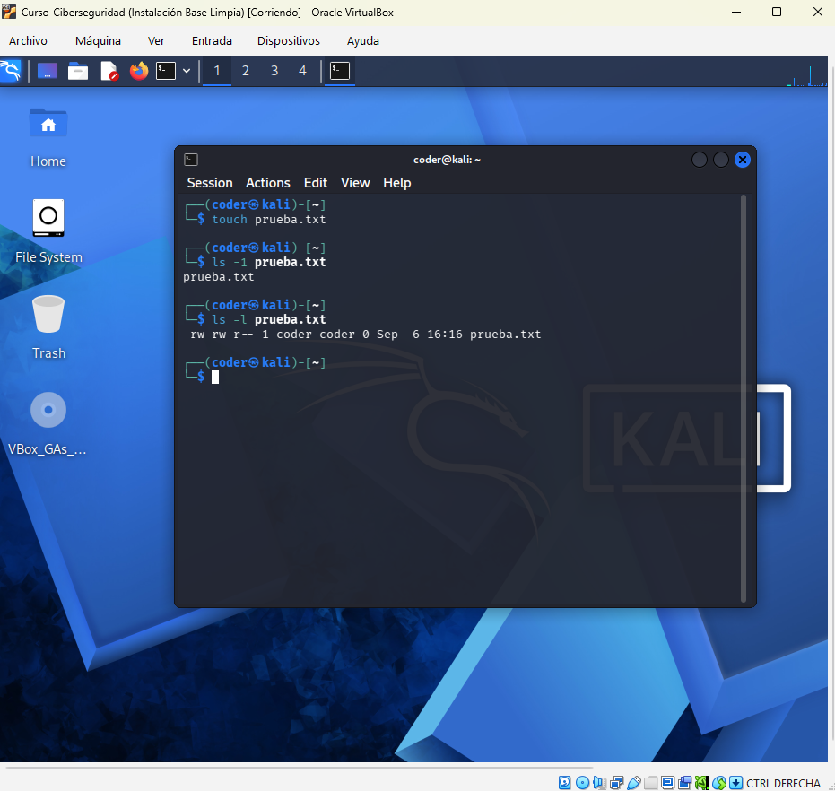
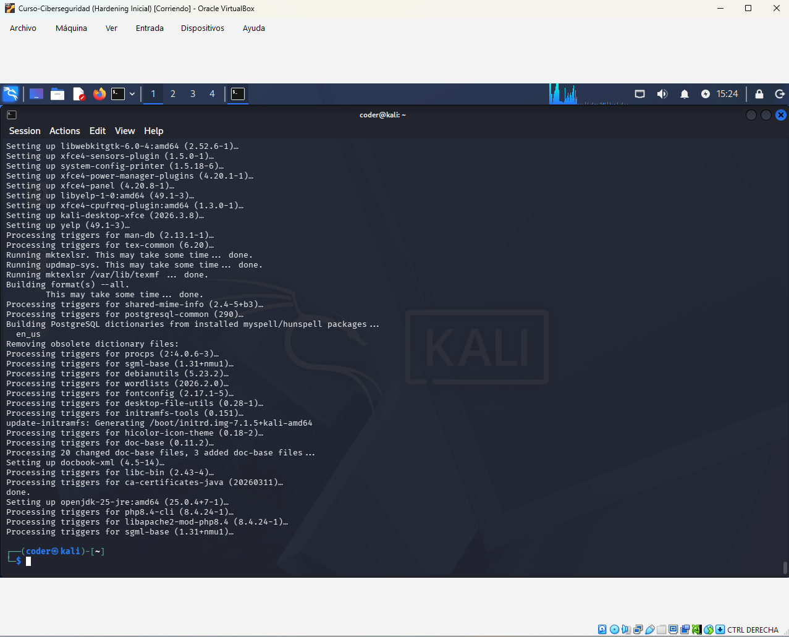
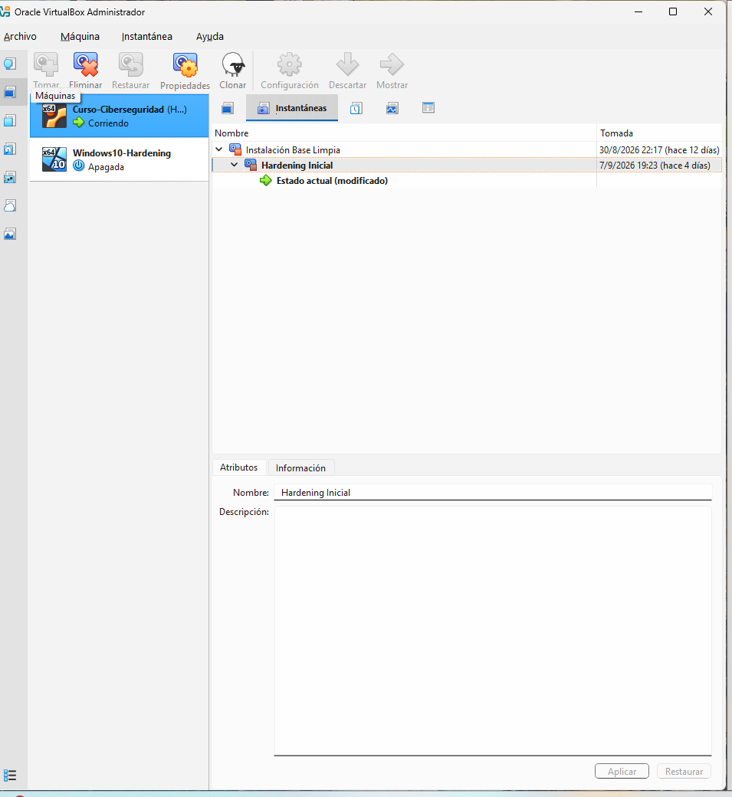

# Laboratorio de Ciberseguridad - Entorno de Pruebas Virtualizado

Entorno de pruebas controlado y aislado, construido con VirtualBox, para el curso de Ciberseguridad. Se utilizan dos máquinas virtuales: **Windows 10 Pro** y **Kali Linux**.

## 1. Configuración de red (NAT)

El adaptador de red de ambas VMs se configuró en modo **NAT (Network Address Translation)**. En este modo, la VM accede a internet a través de la conexión del equipo host, pero no queda expuesta ni es alcanzable directamente desde la red local (Wi-Fi/LAN) del host: el host actúa como intermediario y oculta a la VM detrás de su propia dirección.

Se eligió NAT (y se descartó el modo **Puente/Bridged**) porque Bridged le asigna a la VM una IP propia y visible dentro de la red física, dejándola expuesta a cualquier otro dispositivo de esa red. Con NAT, la máquina de prácticas —que puede tener herramientas o configuraciones deliberadamente vulnerables— permanece aislada del resto de la red doméstica/oficina, protegiendo tanto al equipo host como a otros dispositivos conectados a la misma red.

## 2. Capa Windows: usuarios y actualizaciones

Se creó una cuenta local "UsuarioSeguro" configurada explícitamente como **Usuario estándar**, separada de la cuenta Administrador. Esto aplica el Principio de Menor Privilegio: el trabajo diario no requiere permisos administrativos, limitando el daño posible si se ejecutara software malicioso.

Se verificó que Windows Update busca y descarga activamente actualizaciones de seguridad, reduciendo la ventana de exposición a vulnerabilidades ya corregidas por el fabricante.

## 3. Capa Linux: permisos y actualizaciones

Se creó un archivo de prueba y se listaron sus permisos con `ls -l`, mostrando el modelo de permisos de Linux (lectura/escritura/ejecución para dueño, grupo y otros) — base para evitar permisos excesivos como `chmod 777`.

Se ejecutó `sudo apt update && sudo apt upgrade` para sincronizar la lista de paquetes e instalar las actualizaciones disponibles, usando `sudo` puntualmente en vez de trabajar como root de forma permanente.

## 4. Snapshot inicial

Con el hardening básico aplicado, se apagó la VM y se creó la instantánea **"Hardening Inicial"** desde el Administrador de Instantáneas de VirtualBox. Este snapshot es el punto de restauración: si una práctica futura rompe o compromete el sistema, se puede volver a este estado limpio y ya endurecido sin reinstalar todo desde cero.

## Detalles del entorno

- **Hipervisor:** VirtualBox
- **Sistemas invitados:** Windows 10 Pro (amd64) y Kali Linux (amd64)
- **Recursos asignados:** 2 GB RAM, 2 núcleos de CPU
- **Modo de red:** NAT
- **Snapshot inicial:** "Hardening Inicial"
